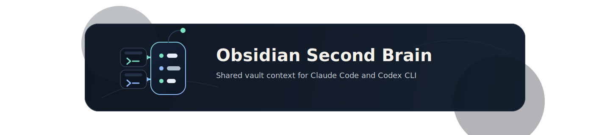

<p align="center">
  
</p>

# Obsidian Second Brain

> Connects **Claude Code** and **Codex CLI** to an **Obsidian vault**
> that serves as a shared, persistent "second brain" for development,
> planning, and knowledge work.

This repo provides the installer and the skill sources. The vault itself is
the user's personal knowledge base and is not managed here.

---

## Contents

- [Motivation](#motivation)
  - [Why This Project?](#why-this-project)
  - [What It Solves](#what-it-solves)
  - [Benefits at a Glance](#benefits-at-a-glance)
  - [Typical Use Cases](#typical-use-cases)
- [Installation](#installation)
  - [Requirements](#requirements)
  - [Quick Start](#quick-start)
  - [Non-Interactive Mode](#non-interactive-mode)
- [What the Installer Does](#what-the-installer-does)
  - [The Five Tasks](#the-five-tasks)
  - [Repository Structure](#repository-structure)
  - [Vault Structure After Setup](#vault-structure-after-setup)
- [Usage](#usage)
  - [Trigger Templates in External Projects](#trigger-templates-in-external-projects)
  - [Project Context Between Sessions](#project-context-between-sessions)
  - [Vault Resolution at Runtime](#vault-resolution-at-runtime)
- [Maintenance](#maintenance)
  - [Repairs and Updates](#repairs-and-updates)
  - [Regenerating Skill Wrappers](#regenerating-skill-wrappers)
- [Further Documentation](#further-documentation)
- [License](#license)

---

## Motivation

### Why This Project?

AI assistants forget everything at the end of each session. If you work on
multiple projects over weeks or months, you end up repeating the same
context again and again: architecture decisions, open questions, writing
style, project goals, and known pitfalls.

An Obsidian vault is a good place for that knowledge, but a CLI session
does not automatically talk to the vault, and the vault itself has no
built-in rules for where new information belongs.

**This repo closes that gap.** It turns an existing or newly created
Obsidian vault into the authoritative, persistent knowledge base for Claude
Code and Codex CLI, with clear routing rules, safety rules, and a shared
project structure that both tools use.

### What It Solves

| Problem | Solution |
|---|---|
| Context loss between sessions | The skill reads `Brain.md`, the project note, and the latest Daily Notes at startup. A new session begins with the context from the previous one. |
| Duplicated knowledge maintenance | One physical vault. Multiple project repos can mount it under stable names instead of building per-repo note graveyards. |
| Unclear note placement | `Brain.md` and `references/note-routing.md` decide where new notes belong. Trigger phrases such as `merk dir das`, `speicher das`, and `halte das fest` route information into the correct note. |
| Tool silos | Claude Code and Codex CLI read from the same source using the same rules. Results from one session are immediately visible in the other. |
| Fragile onboarding in new projects | Copy-paste `CLAUDE.md` or `AGENTS.md` into the project root. The vault path stays outside the project repo and is resolved centrally from the skill config. |

### Benefits at a Glance

- **One vault, two CLIs, one truth.** The same skill behavior in Claude
  Code and Codex CLI, generated from a shared `skill-body.md`.
- **Portable.** Trigger templates do not contain the vault path, so
  projects remain shareable without leaking personal file paths.
- **Idempotent and repairable.** You can run `install.py` repeatedly,
  execute individual tasks, and repoint vault paths later.
- **Cross-platform.** Windows, macOS, Linux, and WSL are supported,
  including automatic detection of the Windows home directory under
  `/mnt/c/Users/...`.
- **Clear safety rules.** The skill asks before deleting, moving, or
  broadly rewriting content. `Projektkompass.md` is explicitly marked as a
  cache and never becomes the silent source of truth.
- **Three-layer context model.** Daily Notes for session deltas, the
  canonical project note for truth, and an optional project compass as a
  derived cache for large projects, with no global `memory/` directory.

### Typical Use Cases

- **Long-running development projects** where architecture and status
  decisions need to stay consistent over time.
- **Brainstorming and planning** where durable insights should flow
  directly into the right project or resource note instead of disappearing
  at session end.
- **Workshop and research work** where technical knowledge should land in
  `04 Ressourcen/` instead of being buried in chat history.
- **Multi-project workflows** where several repos use the same vault and
  notes remain available regardless of the current working directory.

---

## Installation

### Requirements

- Python 3.10+ (tested with 3.12)
- Claude Code and/or Codex CLI installed
- Optional: an existing Obsidian vault

> The script is cross-platform and works on Windows, macOS, Linux, and
> WSL. Under WSL, the installer automatically detects the Windows home
> directory under `/mnt/c/Users/...` and can install there as well.

### Quick Start

```bash
git clone <repo-url>
cd obsidian-second-brain
python install.py
```

The wizard walks through:

1. Selecting the target CLIs (`all` / `codex` / `claude`)
2. Selecting the home directories (auto-detected, manually overridable)
3. Choosing the vault mode:
   - **`new`** - create a new vault (default path: `~/.obsidian_brain`)
   - **`existing`** - connect an existing vault. If `Brain.md` is missing,
     the installer asks whether it should be created.
4. Reviewing the summary and confirming
5. Running the tasks step by step

### Non-Interactive Mode

```bash
python install.py \
  --tool claude \
  --home /home/user \
  --vault-root /home/user/MyVault \
  --task install-skills \
  --task configure-skill-config
```

| Flag | Description |
|---|---|
| `--tool` | `all`, `codex`, or `claude` (default: `all`) |
| `--home` | Target home directory. Can be passed multiple times. |
| `--vault-root` | Physical path to the vault. Falls back to `$OBSIDIAN_SECOND_BRAIN_ROOT` and then to `src/scripts/config.json`. |
| `--task` | Run specific tasks only. Can be passed multiple times. |

---

## What the Installer Does

### The Five Tasks

| Task | What happens |
|---|---|
| `install-skills` | Copies `src/claude/obsidian-second-brain/` and `src/codex/obsidian-second-brain/` into the target home directories. Adds `scripts/` (including `resolve_vault_context.py` and `config.json`), `references/`, and `init/` from `src/`. |
| `configure-skill-config` | Writes the vault path in both Windows and POSIX form into the installed skills' `config.json`. |
| `create-vault` | Creates the vault folder with all top-level folders (`00 Kontext` through `07 Anhänge`), plus a `README.md` and a `Brain.md`. Existing files are not overwritten. |
| `configure-clis` | Creates the trigger templates `CLAUDE.md` and `AGENTS.md` inside the vault under `04 Ressourcen/Skills/obsidian-second-brain/`. It also removes old managed blocks from global `~/.claude/CLAUDE.md` and `~/.codex/AGENTS.md`. |
| `verify-setup` | Checks whether the vault, skill installations, `config.json`, and templates are present and correct. |

### Repository Structure

```text
obsidian-second-brain/
├── install.py                     # entry point (interactive or via flags)
├── docs/
│   └── install-process.md         # detailed installer documentation
├── scripts/                       # installer code (not installed)
│   ├── render_skill_wrappers.py
│   └── setup_tasks/
│       ├── cli.py
│       ├── configure_clis.py
│       ├── configure_skill_config.py
│       ├── create_vault.py
│       ├── install_skills.py
│       ├── models.py
│       ├── shared.py
│       ├── skill_renderer.py
│       ├── verify_setup.py
│       └── wizard.py
└── src/                           # everything that gets installed or copied into the vault
    ├── claude/obsidian-second-brain/SKILL.md
    ├── codex/obsidian-second-brain/
    │   ├── SKILL.md
    │   └── agents/openai.yaml
    ├── shared/skill-body.md       # canonical skill description (single source)
    ├── references/note-routing.md # fallback routing rules
    ├── init/Brain.md              # generic Brain.md template for fresh vaults
    └── scripts/
        ├── load_project_context.py
        ├── persist_project_delta.py
        ├── rebuild_project_kompass.py
        ├── project_context.py
        ├── resolve_vault_context.py
        └── config.json
```

### Vault Structure After Setup

After a fresh `create-vault` run, the vault looks like this:

```text
<vault>/
├── Brain.md                       # navigation and routing layer
├── README.md
├── 00 Kontext/                    # personal context profile
├── 01 Inbox/                      # unsorted thoughts
├── 02 Projekte/                   # active projects
├── 03 Bereiche/                   # ongoing responsibility areas
├── 04 Ressourcen/                 # reusable knowledge
│   └── Skills/obsidian-second-brain/
│       ├── CLAUDE.md              # trigger template
│       └── AGENTS.md              # trigger template
├── 05 Daily Notes/
├── 06 Archive/
└── 07 Anhänge/
```

> Details about the underlying philosophy, similar to PARA and based on
> projects starting as single `.md` files until they need subnotes, live in
> the generated `Brain.md`. The canonical template is
> [`src/init/Brain.md`](src/init/Brain.md).

---

## Usage

### Trigger Templates in External Projects

To make the skill activate automatically in any project, the vault contains
two copy-paste templates:

```text
<vault>/04 Ressourcen/Skills/obsidian-second-brain/
├── CLAUDE.md      # for projects using Claude Code
└── AGENTS.md      # for projects using Codex CLI
```

**How to wire the skill into another project:**

1. Copy the appropriate file into the root of that project.
2. Start Claude Code or Codex CLI in that project.
3. The globally installed `obsidian-second-brain` skill loads
   automatically and reads the vault path from its `config.json`.

> The templates contain **no** vault path. That keeps them portable and
> prevents sensitive paths from leaking into unrelated repos.

### Project Context Between Sessions

The repo uses a **three-layer model** for resumable project context:

| Layer | Role | Location |
|---|---|---|
| 1. Session deltas | Daily notes with decisions, problems, and next starting points | `05 Daily Notes/` |
| 2. Source of truth | Canonical main project note | `02 Projekte/<ProjectName>.md` or `02 Projekte/<ProjectName>/<ProjectName>.md` |
| 3. Derived cache | Optional project compass for large projects | `02 Projekte/<ProjectName>/Projektkompass.md` |

A `Projektkompass.md` is only created for folder-based projects, and only
when the main note has more than 300 non-empty lines or the project has
more than 3 domain subnotes outside `Tasks/`. The note must include
frontmatter such as `note_role: project_digest`, `truth_source: false`,
and `write_policy: consolidate_only`.

**Runtime helpers under `src/scripts/`:**

| Script | Purpose |
|---|---|
| [`load_project_context.py`](src/scripts/load_project_context.py) | Returns the recommended reading order for project context. |
| [`persist_project_delta.py`](src/scripts/persist_project_delta.py) | Writes session deltas into Daily Notes. |
| [`rebuild_project_kompass.py`](src/scripts/rebuild_project_kompass.py) | Rebuilds the derived project compass. |

### Vault Resolution at Runtime

The script
[`src/scripts/resolve_vault_context.py`](src/scripts/resolve_vault_context.py)
is called by the skill at runtime and determines the active vault. The
resolution order is:

1. Environment variable `OBSIDIAN_SECOND_BRAIN_ROOT`
2. `scripts/config.json` (written by the installer)
3. Mount patterns in the current working directory: `obsidian`,
   `obsidian_brain`, `.obsidian_brain`
4. Fallback: `~/.obsidian_brain`

> This makes it possible to move the vault path later without reinstalling
> everything, by changing only the installed skill's `config.json`.

---

## Maintenance

### Repairs and Updates

The installer is idempotent and can be run repeatedly:

```bash
# Reinstall only the skill files and verify the setup
python install.py --task install-skills --task verify-setup

# Refresh only the trigger templates in the vault
python install.py --task configure-clis

# Repoint the config to a new vault path
python install.py --task configure-skill-config --vault-root /new/path
```

### Regenerating Skill Wrappers

The `SKILL.md` files under `src/claude/...` and `src/codex/...` are
generated from `src/shared/skill-body.md`. After changing the shared body:

```bash
python scripts/render_skill_wrappers.py
```

---

## Further Documentation

- [`docs/install-process.md`](docs/install-process.md) - detailed task
  descriptions, output artifacts, and repair recipes
- [`src/shared/skill-body.md`](src/shared/skill-body.md) - canonical skill
  description
- [`src/references/note-routing.md`](src/references/note-routing.md) -
  fallback rules for routing new notes when `Brain.md` does not answer the
  question

---

## License

This repo is intended as a personal setup tool. If you reuse it, the usual
rules apply: feel free to use it, do not break it, and ask if anything is
unclear.
